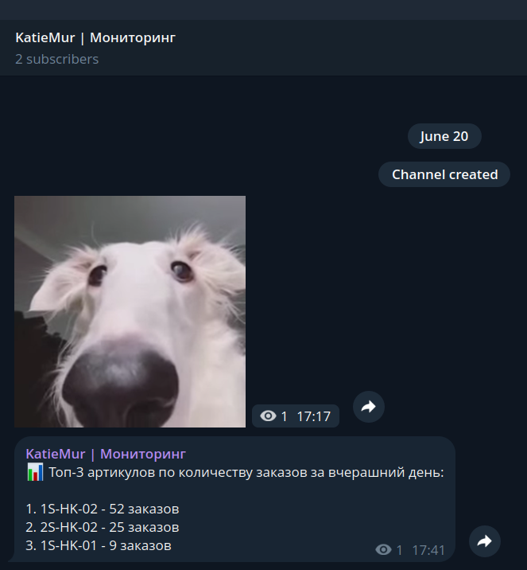
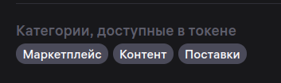

# KatieMur Alert Bot

Сервис для выгрузки заказов из Wildberries API, агрегации данных и отправки отчета в Telegram.

### Примечание
- Проект сделан в рамках тестового задания. Логика намеренно сильно упрощена без избыточной архитектуры, лишних проверок аргументов и малого кол-ва зависимостей.
- Блок ```Ответы на вопросы``` содержит в себе размышления по развитию инфраструктуры с использованием ИИ.
- Токен предложенный в ТЗ, не позволяет получить некоторые данные, т.к. у него доступ только к статистике. Поэтому, во время разработки, я использовал другой токен, с другими разрешениями. Данные по продажам можно получать (и даже нужно) из статистики, но в любом случае, могут понадобиться более детальная информация по товарам и статусам. Ниже будет указано, какие у токена должны быть разрешения.
- Для статусов заказов был сделан небольшой маппер, который приходит их к более понятным для продовца.
- Данные хранятся в CSV и поэтому они все текстовые, но я указал их ожидаемые типы в таблице ниже.

---

## Функциональность

- Получение из WB API за один день:
    - карточек товаров
    - заказов за выбранный период  
    - статусов заказов  
- Обогащение данных (название товара, статус)  
- Маппинг статусов в бизнес-формат
- Сохранение данных в формате CSV
- Генерация отчета:  
  - Топ артикулов по количеству заказов  
- Отправка отчета в Telegram  

Пользовательский ввод в файле ```main.py```:
  - ```days_ago``` - шаг периода. По стандарту, стоит сегодняшний день (т.е. 0, а 1 будет считаться вчера).
  - ```file_path``` - путь к CSV файлу. Можно вызвать ```TGBotClient.create_report``` отдельно, передав путь вручную. Например: ```files/order-01-01-2001.csv```

Изменяемый параметр ```file_path``` в классе ```TGBotClient``` метода ```create_report в файле``` ```main.py``` . Шаг периода. По стандарту, стоит сегодняшний день (т.е. 0, а '1' будет считаться вчера).

---

## Стек

- Python 3.10+
- httpx
- python-dotenv
- csv (stdlib)

---

## Установка

```bash
git clone https://github.com/your_username/wb-orders-bot.git
cd wb-orders-bot

python -m venv venv

source venv/bin/activate  # Linux / Mac
venv\Scripts\activate     # Windows

pip install -r requirements.txt
```

---

## Настройка окружения

Создайте файл `.env` (для удобства создан `.env.example`):

```
WB_TIMEZONE=Europe/Moscow
WB_TOKEN=your_wb_token
WB_BASE_MARKET_URL=https://marketplace-api.wildberries.ru
WB_BASE_CONTENT_URL=https://content-api.wildberries.ru

TG_BASE_URL=https://api.telegram.org/bot
TG_BOT_TOKEN=your_telegram_bot_token
TG_CHAT_ID=your_chat_id
TG_PROXY=your_proxy_if_exists
```

---

## Запуск

```bash
python main.py
```

---
## Модель данных

| Поле         | Тип      | Описание          |
|--------------|----------|-------------------|
| order_date   | date     | Дата заказа       |
| article      | str      | Артикул продавца  |
| product_name | str      | Название товара   |
| status       | str      | Статус            |
| price        | decimal  | Сумма заказа      |

---
## Структура отчета в Telegram

```
{порядковый номер}. {артикул продавца} - {кол-во заказов (без фильтрации по статусу)}
```

## Пример отчета в Telegram

```
📊 Топ-3 артикулов по количеству заказов:

1. A123 - 15 заказов
2. B456 - 10 заказов
3. C789 - 7 заказов
```



---

## Архитектура

- WBClient - работа с Wildberries API  
- WBMapper - нормализация статусов  
- TGBotClient - генерация и отправка отчетов
- Main - запуск выполнения

---

## Структура проекта

```
.
├── main.py
├── loader.py
├── bot.py
├── requirements.txt
├── .env
└── files/
    └── orders-*.csv
```

---

## Зависимости

```
httpx==0.28.1
python-dotenv==1.2.2
```

---
## Токен

Токен можно проверить по этому [адресу](https://dev.wildberries.ru/jwt).

На данный момент, в проекте используются категории:
  - Маркетплейс
  - Контент



---

## Ответы на вопросы

### Перенос хранилища из Google Sheets
На данный момент, у нас получился зачаточный вариант ETL пайплайна. Его можно немного улучшить и оставить легковесным, дешевым и работающим прямо из venv.

Во-первых, пишем коннектор (через ```gspread```) для сбора данных из Google Sheets (или архивации данных оттуда) и заодно для записи туда. Рассматриваем с учетом того, что какие-то данные мы будем отправлять в Google Sheets (может быть там будут небольшие дашборды или нужны данные для анализа с постоянным обновлением).

Во-вторых, сохранение данных в CSV, как архив или хранилище, в целом, рабочий вариант, но можно его улучшить просто заменив его Parquet-файлом. Это файл с колоночной структурой хранения и он хорошо подойдет для аналитики (та самая агрегация, которая была в задаче). Есть и другие форматы файлов для хранения данных (Avro, ORC, Lance и др.), но Parquet более распрастранен и к нему можно подключаться даже из BI-платформ.

В-третьих, использование СУБД. Если мы будем хранить данные в файлах из второго шага, то мы можем к ним подключаться напрямую, то есть в операторах ```FROM``` мы будем указывать путь к файлу на сервере. В этом случае, СУБД будет использоваться не для хранения, а как SQL-движок для обработки данных. Но данные также можно просто хранить и в СУБД. Для аналитики хорошо подходит DuckDB и ClickHouse. На данном этапе предлагаю использовать DuckDB, т.к. это самый простой и быстрый вариант для старта. Когда данных будет уже много, можно без проблем мигрировать на ClickHouse, т.к. данные будут храниться в Parquet, то переноса данных не потребуется (эти же самый SQL запросы просто будут запускаться на ClickHouse).

В-четвертых, имеет смысл добавить Prefect. Это легкий оркестратор, с помощью которого, можно будет легко выставлять расписание и следить за выполнением пайплайнов, ошибками, получать отчеты о проверках данных и т.д.

В-пятых, можно добавить оперативные дашборды ```streamlt``` для данных, которые нужно мониторить постоянно. Графики лучше воспринимаются, чем текст и могут быть более наглядными, а еще есть интерактив (переключение даты, например). Вещи, которые можно автоматизировать, лучше оставлять такими без использования ИИ.

В-шестых, составление схем данных с описаниями, гайдами, инструкциями, правилами. Нейронным сетям, важен контекст, поэтому при выполнении запросов им будет отправляться небольшая сводка о том, где и что хранится. Нейронка не должна обрабатывать весь массив данных из СУБД или файла, она должна составить SQL-запросы и получить агрегированные данные или же обращаться к аналитически (уже подготовленным) витринам. Уже на их основе, будут делаться выводы. Постепенно, будет формироваться база знаний и можно реализовать RAG. Также, у нейронной сети, будут созданы инструменты для чтения данных из разных источников (БД, файлов, сервисы) и отправки их в мессенджеры, email и т.д. Также она сможет формировать дашборды. Инструменты будут иметь определенные права доступа, чтобы она не снесла все данные в БД.

В-седьмых, еще можно добавить валидацию данных ```Great Expectations``` и моделирование аналитических витрин ```SQLMesh```. На случай, если будет много аналитики и будет нужда в Data Quality.

### Улучшения в текущей реализации
Здесь нужно достачно изменений и много можно переделать, т.к. я намеренно старался писать проще.

- Коннекторы к сервисам, БД, SDK и др., как отдельные классы (ну например, класс конекта).
- Pydantic для проверки типов входящих данных и возможной трансформации.
- Асинхронщина практически везде.
- Формирование отдельных классов под получаемые сущности (заказы, товары и т.д.) с методами обработки.
- Доп. разбиение ответсвенности у некоторых классов. Например, формрование отчета клиенту ТГ Бота не подходит, т.к. клиент Email или ИИ, тоже могут формировать отчет по заданным правилам.
- Вынесение маперов, переменных и констант в .env и yaml-файлы.
- Управление выгрузкой через yaml-файлы и оркестратор.
- Централизованное логирование и сбор логов.
- Составление отчетов о выполнении и отпрвки в ТГ.
- Кэширование или запись в БД (чтобы не перезагружать данные одни и те же) и возможное, временное сохранение JSON-файлов выгрузок.
- и др.

Нет предела совершенству. Стоит отметить, что это список того, что хотелось бы добавить, а не того, что это обязательно нужно.

